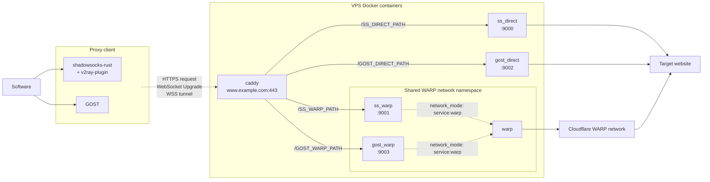

# proxy_deploy

Deploy **shadowsocks-rust** and **gost** servers behind one Caddy HTTPS endpoint.

## Architecture

`Software` is the application using the proxy.  
`Proxy client` is **shadowsocks-rust** or **gost** client running on the client device.  
`Target website` is the website or service you want connected to.

The installer generates 4 WebSocket paths.  
Caddy matches each incoming WebSocket path and forwards the connection to the corresponding proxy container.  
Labels such as `/SS_DIRECT_PATH` represent generated values, not literal paths.



## Install

Requirements:

- A VPS
  - `/dev/net/tun` available (KVM recommended; OpenVZ/LXC may not supported)
  - Public IP and Port 80/443
  - Debian 13 (trixie)
  - Root access
- A domain pointing to the VPS, for example `www.example.com`

Run as root on the VPS:

```bash
bash <(curl -fsSL 'https://raw.githubusercontent.com/zmyxpt/proxy_deploy/main/setup.sh')
```

The installer will ask for:

- your domain
- email for Let's Encrypt certificate notices

## Maintenance

The installer creates `/etc/cron.d/proxy_deploy_update`, which runs `update.sh` every Monday at 19:00 UTC.

`update.sh` does the following:

1. updates Debian packages;
1. refreshes and rebuilds containers;
1. prunes unused Docker data;
1. reboots the VPS.  

## Guide for client-side

After server installation, client-side config files can be found in **`~/proxy_deploy-main/client/`**

These configuration files are for **shadowsocks-rust + v2ray-plugin** and **GOST** client,  
You may need to edit them to match your own client setup.
