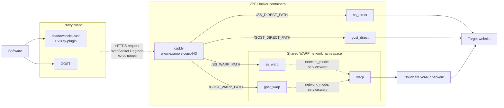

# proxy_deploy

Deploy **shadowsocks-rust** and **gost** servers behind one Caddy HTTPS endpoint.

## Architecture

`Software` is the application using the proxy.  
`Proxy client` is **shadowsocks-rust** or **gost** client running on the client device.  
`Target website` is the website or service you want connected to.

The installer generates 4 WebSocket paths.  
Caddy matches each incoming WebSocket path and forwards the connection to the corresponding proxy container.  
Labels such as `/SS_DIRECT_PATH` represent generated values, not literal paths.



## Install

Requirements:

- A VPS
  - `/dev/net/tun` available (KVM recommended; OpenVZ/LXC may not be supported)
  - Public IP and ports 80/443
  - Debian 13 (trixie)
  - Root access
- A domain pointing to the VPS, for example `www.example.com`

Run as root on the VPS:

```bash
bash <(curl -fsSL 'https://raw.githubusercontent.com/zmyxpt/proxy_deploy/main/scripts/setup.sh')
```

The installer will ask for:

- your domain
- email for Let's Encrypt certificate notices

## Maintenance

Deployment settings are stored in `~/proxy_deploy-main/deploy.conf`. Keep this file private and back it up.

The installer creates `/etc/cron.d/proxy_deploy_update`, which runs `scripts/update.sh` every Monday at 19:00 UTC.

`update.sh` does the following:

1. updates Debian packages;
1. downloads the latest project files;
1. renders server and client configs from `deploy.conf`;
1. refreshes and rebuilds containers;
1. prunes unused Docker data;
1. reboots the VPS.  

## Client configuration

Generated client configs are available in `~/proxy_deploy-main/client-configs/`.

Copy them to your client device before making device-specific changes.

## Project structure

```text
proxy_deploy-main/
├── .gitattributes                  # Enforces LF endings for text files
├── .gitignore                      # Excludes generated and private files
├── README.md
├── compose.yaml                    # Docker Compose file
├── deploy.conf                     # Private deployment settings
├── client-configs/
│   ├── gost.yaml                   # GOST client config
│   ├── ssrust_direct.json          # Shadowsocks direct client config
│   └── ssrust_warp.json            # Shadowsocks WARP client config
├── data/
│   ├── caddy-conf/
│   │   └── Caddyfile               # Generated Caddy configuration
│   ├── caddy-data/                 # Caddy certificates and state
│   ├── cloudflare-warp/            # WARP registration and state
│   ├── shadowsocks-direct/
│   │   └── config.json             # Shadowsocks direct server config
│   ├── shadowsocks-warp/
│   │   └── config.json             # Shadowsocks WARP server config
│   ├── gost-direct/
│   │   └── gost.yaml               # GOST direct server config
│   └── gost-warp/
│       └── gost.yaml               # GOST WARP server config
├── docker/                         # Docker image resources
│   ├── shadowsocks.Dockerfile
│   ├── warp.Dockerfile
│   └── warp-entrypoint.sh
├── scripts/
│   ├── render-configs.sh          # Generates configs
│   ├── setup.sh                   # Initial installation
│   └── update.sh                  # Automated update
└── templates/
    ├── Caddyfile                  # Caddy config template
    ├── deploy.conf                # Deployment settings template
    ├── gost-client.yaml           # GOST client config template
    ├── gost-server.yaml           # GOST server config template
    ├── shadowsocks-rust-client.json  # Shadowsocks client config template
    └── shadowsocks-rust-server.json  # Shadowsocks server config template
```
